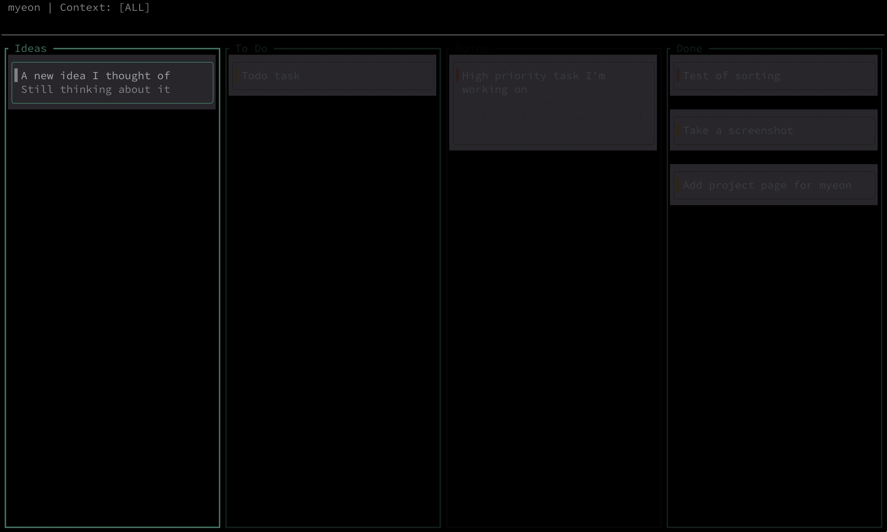

<p align="center">
    
</p>

<h1 align="center">myeon (면)</h1>

`myeon` is a minimalist, keyboard-driven TUI Kanban board built with **Rust** and **Ratatui**.
While [ilseon](https://github.com/cladam/ilseon) is designed for **execution** (the single priority), `myeon` is
designed for **perspective** (the landscape).

It provides a low-sensory, high-focus environment to triage ideas, organise projects, and decide what earns the right to
become your "first line" of work.

## The Philosophy

For neurodivergent users, the "Big Picture" is often a source of anxiety, leading to task paralysis. `myeon` solves this
by applying the **Ilseon Stillness** principles to a Kanban structure:

* **Low Sensory Load:** No flashing colors, no "Overdue" alarms, and no visual clutter. Just your tasks in a calm,
  spatial layout.
* **Contextual Silos:** Filter your entire board by "Work," "Life," or "Project" with a single keystroke. If it’s not
  relevant now, it doesn't exist.
* **The "Planning vs. Doing" Split:** Use `myeon` at your desk to organise the chaos. Use **ilseon** on your mobile to
  execute the result.

## Features

* **Keyboard-First Navigation:** Vim-like bindings for speed and reduced cognitive load.
* **Zen Focus Mode:** Dim all columns except the one you are currently triaging.
* **WIP Soft-Caps:** Gentle visual cues when a column has too many items, encouraging you to finish instead of start.
* **Idea Landing Strip:** A dedicated column for "Exported" notes from the ilseon app.
* **Local-First & Private:** Your data stays on your machine in a simple, human-readable format.

## Installation

You need [Rust and Cargo](https://www.rust-lang.org/tools/install) installed.

### Installing from crates.io

The easiest way to install `myeon` is to download it from [crates.io](https://crates.io/crates/myeon). You can do it
using
the following command:

```bash
cargo install myeon
```

If you want to update `myeon` to the latest version, execute the following command:

```bash
myeon update
```

#### Building from source

Alternatively you can build `myeon` from source using Cargo:

```bash
git clone https://github.com/cladam/myeon.git
cd myeon
sudo cargo install --path . --root /usr/local
```

## Keybindings

* `h/j/k/l`: Move focus across tasks and columns.
* `c`: Change Context (Switch between Work/Personal/Side-project).
* `a`: Quick-capture a new idea into the Inbox.
* `e`: Edit a task
* `d`: Delete a task
* `Enter`: Move the task forward
* `Backspace`: Move a task backwards

## About myeon

In the **ilseon** ecosystem, focus is sacred.

Most Kanban boards are designed for complex project management, often resulting in "information density" that leads to
cognitive overwhelm and task paralysis. **myeon** (Korean for *surface* or *plane*) is the spatial counterpart to the
ilseon mobile app.

While **ilseon** helps you walk the path (The Line), **myeon** helps you map the territory (The Plane). It provides a
high-contrast, low-stimulation environment to organise your thoughts without the "noise" of traditional productivity
software.

## Shared Identity

`myeon` is visually synchronised with the **ilseon** Android app. It utilises the same low-sensory colour palette to
ensure a seamless transition between mobile execution and desktop planning:

* **Stillness Palette:** Uses `#121212` backgrounds to eliminate eye strain during long sessions.
* **Semantic Accents:** Employs `MutedTeal` for active focus and `MutedRed` for urgency, maintaining a consistent mental
  map across devices.
* **OLED Friendly:** Optimised for high-contrast, low-brightness environments.